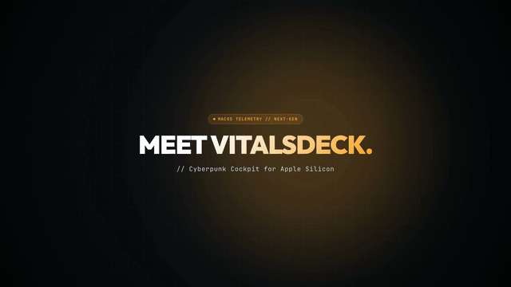
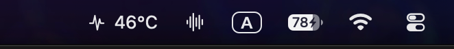
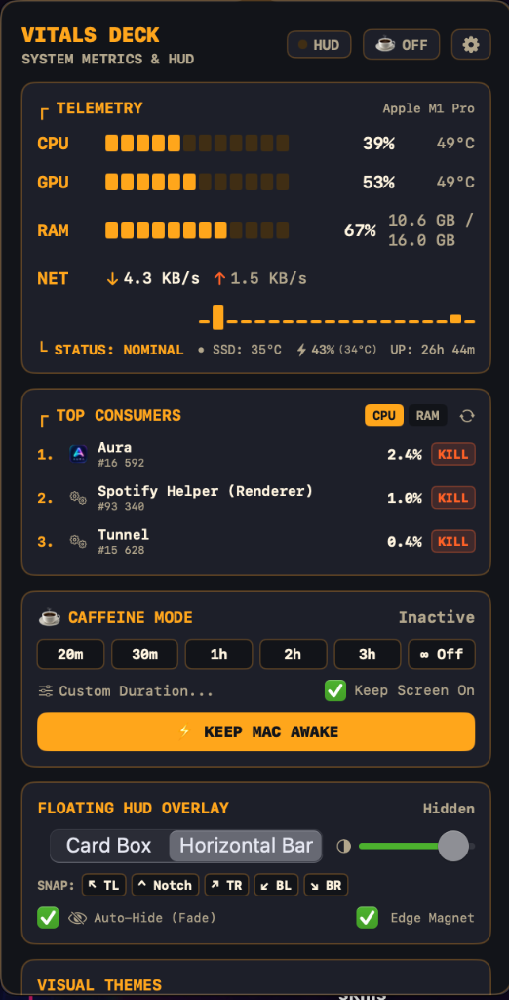
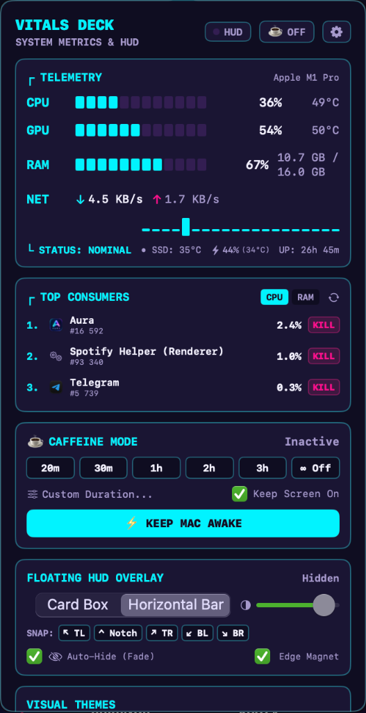
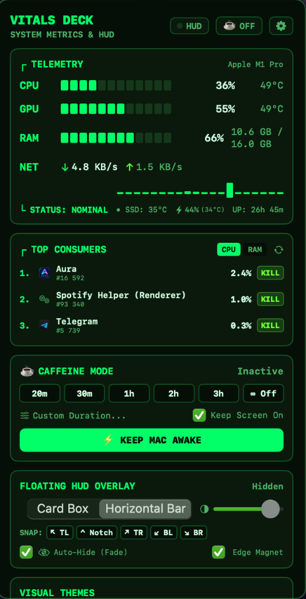
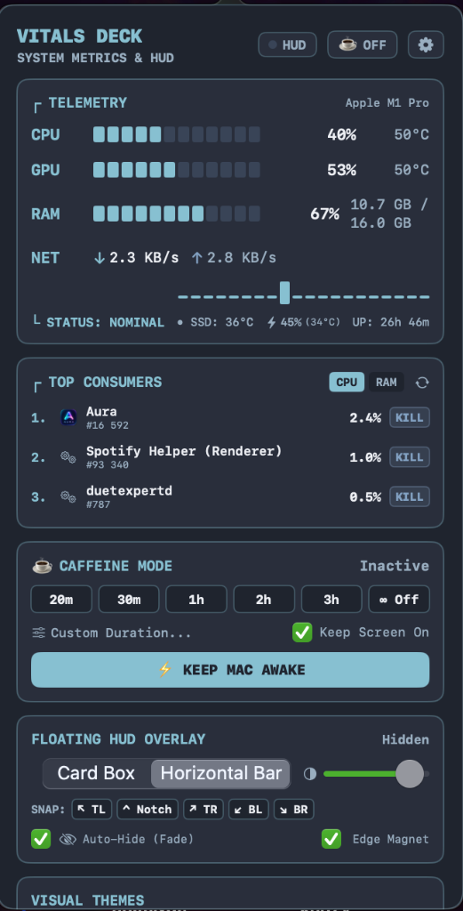
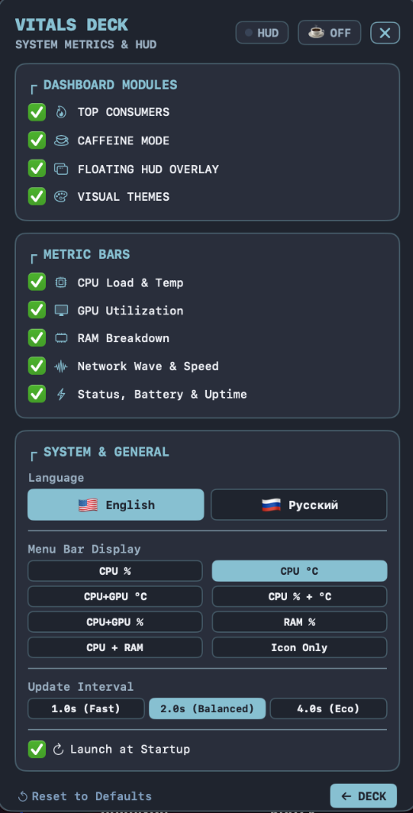

<div align="center">

# ⚡ VitalsDeck

**Cyberpunk Hardware Telemetry & Floating HUD for macOS**  
*Стильный киберпанк-мониторинг ресурсов и плавающий HUD для macOS*

[](https://apple.com)
[](https://apple.com)
[](https://swift.org)
[](https://github.com)
[](https://github.com)
[](LICENSE)

<br/>

<a href="https://github.com/kodzyfox/VitalsDeck/releases/download/v1.0.0/VitalsDeck-Trailer.mp4">
  
</a>

<p align="center">
  <a href="https://github.com/kodzyfox/VitalsDeck/releases/download/v1.0.0/VitalsDeck-Trailer.mp4">
    
  </a>
  <a href="https://github.com/kodzyfox/VitalsDeck/releases/tag/v1.0.0">
    
  </a>
</p>

<br/>



<br/>



</div>

---

### [English](#english-overview) • [Русский](#обзор-на-русском)

---

<a name="english-overview"></a>
## 🌐 English Overview

**VitalsDeck** is a lightweight, futuristic hardware monitor for macOS. It replaces boring system meters with a retro-cyberpunk telemetry deck featuring real-time Apple Silicon temperatures, ASCII load gauges, an on-screen floating HUD, sleep prevention (Caffeine), and 5 distinct aesthetic themes.

### ✨ Key Features

- 🌡️ **Real Hardware Temperatures**: Live die temperatures for Apple Silicon CPU, GPU, SSD, and battery (e.g. `46°C`) displayed right in your macOS menu bar.
- 📊 **ASCII Telemetry Meters**: Cyberpunk text-based gauges `[██████░░░░]` for CPU load, GPU utilization, RAM breakdown, and network I/O speed.
- ☕ **Caffeine Mode**: Prevent sleep with 1 click during long renders or downloads (`20m`, `30m`, `1h`, `2h`, `3h`, `∞ Indefinite`).
- ⚡ **Process Terminator**: Instant 1-click `KILL` buttons for top CPU and RAM hogs with built-in system process protection.
- 🪟 **Floating HUD Overlay**: Pin an always-on-top HUD widget anywhere on screen or snap it under the camera notch.
- 🎨 **5 Aesthetic Themes**: 
  - **Signal Amber** (Cyberpunk Hardware)
  - **Matrix Green** (Classic CRT Phosphor)
  - **Tokyo Neon** (Cyber Synthwave)
  - **OLED Mono** (Clean Minimal Stealth)
  - **Nord Frost** (Arctic Slate & Teal)
- ⚙️ **Modular Settings**: English & Русский support, toggle visible dashboard modules, and select update interval (1.0s, 2.0s, or 4.0s Eco mode).
- 🚀 **Near-Zero Footprint**: Uses native C `libproc` kernel syscalls instead of subshells. Consumes **< 0.6% CPU** and **~14 MB RAM** without draining battery.

<div align="center">
  
  
  
  
</div>

### 🎬 Video Preview & Trailer

https://github.com/kodzyfox/VitalsDeck/releases/download/v1.0.0/VitalsDeck-Trailer.mp4

> 💡 *Quick 25-second cinematic overview showing menu bar stats, themes in action, and the floating HUD. High-res MP4 with soundtrack also available in [Releases](https://github.com/kodzyfox/VitalsDeck/releases/tag/v1.0.0).*

### 🛠️ Build & Install

Requirements: macOS 13.0+ and Xcode Command Line Tools.

```bash
# Clone the repository
git clone https://github.com/kodzyfox/VitalsDeck.git
cd VitalsDeck

# Build the release app bundle
./build_app.sh

# Launch VitalsDeck
open VitalsDeck.app
```

---

<a name="обзор-на-русском"></a>
## 🇷🇺 Обзор на русском

**VitalsDeck** — это сверхлёгкая и стильная утилита мониторинга ресурсов в стиле киберпанк для macOS. Она заменяет скучный системный мониторинг на футуристичный дашборд с реальными температурами датчиков Apple Silicon, ASCII-шкалами нагрузки, плавающим HUD поверх всех окон, защитой от сна (Caffeine) и 5 цветовыми темами.

### ✨ Главные возможности

- 🌡️ **Реальная температура CPU & GPU**: Прямое чтение датчиков кристалла Apple Silicon (M1/M2/M3/M4) без root-прав. Температура выводится прямо в строку меню macOS (`46°C`).
- 📊 **Ретро ASCII-шкалы**: Графика `[██████░░░░]` для мониторинга нагрузки CPU, GPU, оперативной памяти и сетевого трафика.
- ☕ **Режим Caffeine (Защита от сна)**: Предотвращает засыпание Mac в один клик во время рендера или загрузок (`20 мин`, `1 час`, `3 часа`, `∞ Бесконечно`).
- ⚡ **Process Terminator**: Мгновенный Kill Switch для 3 самых прожорливых процессов по CPU или RAM с защитой от случайного нажатия.
- 🪟 **Floating HUD (Плавающий оверлей)**: Виджет поверх всех окон, игр и рабочих столов с примагничиванием к краям экрана и под чёлку дисплея (Notch).
- 🎨 **5 визуальных тем**: Мгновенное переключение между Signal Amber, Matrix Green, Tokyo Neon, OLED Mono и Nord Frost.
- ⚙️ **Модульные настройки**: Полный перевод на русский и английский языки, отключение ненужных блоков для экономии места и выбор частоты опроса (включая режим Eco).
- 🚀 **Минимальная нагрузка**: Работает на системных вызовах `libproc` ядра macOS. Потребляет **менее 0.6% CPU** и всего **~14 МБ RAM**.

### 🎬 Видеоролик приложения

https://github.com/kodzyfox/VitalsDeck/releases/download/v1.0.0/VitalsDeck-Trailer.mp4

> 💡 *Короткий 25-секундный обзор возможностей утилиты: температура в статус-баре, 5 цветовых тем и плавающий HUD. Ролик в 1080p также прикреплен в [Releases](https://github.com/kodzyfox/VitalsDeck/releases/tag/v1.0.0).*

### 🛠️ Сборка и запуск

Требования: macOS 13.0+ и установленные инструменты разработчика Xcode (`xcode-select --install`).

```bash
# Клонировать репозиторий
git clone https://github.com/kodzyfox/VitalsDeck.git
cd VitalsDeck

# Собрать приложение
./build_app.sh

# Запустить
open VitalsDeck.app
```

---

## 📄 License

Distributed under the **MIT License**. Free for personal and commercial use.
